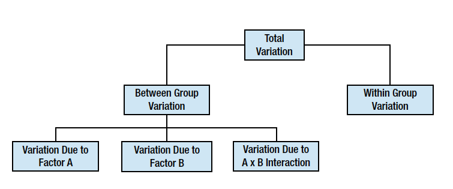

# 方差分析

## One-Way ANOVA

T检验只能比较两样本均值，而方差分析（analysis of variance, ANOVA）能够同时比较多个均值，ANOVA通过分析方差来计算均值是否和总体有显著性差异，ANOVA把方差分为处理效应（treatment effect，真实差异)和误差（error，抽样误差或个体差异）两个来源，两个方差的比值服从F分布，因为方差本身就是个体和均值差平方和，所以对方差组成的分析能够反映均值的差异。

"处理"项是均值间的差异，而“误差”项是组内的差异，习惯性地称之为组间(between)差异和组内(within)差异。
把所有分组混在一起，当成一个样本，总的方差为：
$$SS_{tot} = \sum(x-\bar{x})^2$$
将其分为组间方差和组内方差：
$$SS_{tot} = SS_b+SS_w$$
其中组间方差为：
$$SS_b=\sum_{j=1}^k n_j(\bar{x_j}-\bar{\bar{x}})^2$$
组间自由度是k-1，k是分组的个数，通常将组间方差除以组间自由度，得到组间均方(between groups mean square)，代表组间均值的处理效应。
组内方差为：
$$SS_w=\sum_{j=1}^k\sum_{i=1}^{n_j}(x_{ij}-\bar{x_j})^2$$
组内自由度是N-k，N是把所有分组当成一个样本的样本量，通常将组内方差除以组内自由度，得到组内均方(within groups mean square)，代表组内误差。

方差分析所使用的均方，也就是上面公式所计算的方差除以相应的自由度。

### 单向方差分析
```{r aov1.fig1, width=6, height=6}
data(mpg)
mpg$cyl=factor(mpg$cyl)
head(mpg)
boxplot(displ~cyl, data=mpg)
```
如果我们根据不同汽缸数（cylinders, cyl变量）对汽车进行分组，分析发动机排量（engine displacement, displ变量）均值是否不同，从图上可以看到，汽缸数越多，排量越大。


```{r}
res=aov(displ~cyl, data=mpg)
summary(res)
```

one way ANOVA的零假设是所有均值都相等，备择假设是至少有一个均值是有差别的。
这里计算出来的p值非常小，意味着reject零假设，接受备择假设。

one way anova给出的是总体信息，并没有对均值间两两进行统计的信息，并不清楚分组间谁和谁有显著性差异，想要知道这个信息，需要再进行后续分析。

我们可以先看一下均值：
```{r}
model.tables(res, type="means")
```

## TukeyHSD - Tukey honestly significant difference
对one way anova进行后续分析有很多方法，方差分析由R. A. Fisher提出，他设计出Fisher LSD (least significant difference)标准，现在很多统计学者认为这个方法太自由，现在普遍使用的是Tukey HSD检验，比Fisher LSD要保守得多。
```{r}
TukeyHSD(res)
```

它会计算不同组两两之间的差异、置信区间和较正后的p值。

TukeyHSD并不仅限于单向方差分析，它可以对各种方差分析进行后续的分析。


### 两两T检验
如果只是多组实验，只需要两两比较均值的话，可以对分组两两进行T检验，当然必须进行p值较正，因为随着统计检验次数的增加，犯I类错误的概率会不断增大。方差分析对于复杂的实验设计是很有优势的，比如[多因素，重复测量数据](advanced_anova.html)。

stats包里提供了pairwise.t.test()函数，可以进行两两T检验，还能对p值进行较正，使用起来很方便：

```{r}
with(mpg, pairwise.t.test(displ, cyl, p.adjust.method="bonferroni"))
```

### 如何理解方差分析
单向方差分析是最简单的，因为只有一个因素，[双向方差分析](two_way_anova.html)考虑两个因素，理解了这两种ANOVA分析，那么对于多因素N-WAY ANOVA自然也不在话下。而一些高级的ANOVA可以针对复杂的实验设计，虽然复杂，但其基础思想是高度一致的。

很多人可能有疑问，为什么分析方差可以来检验均值？方差本身就是离均差的平方和，但这样的解释似乎不够。

我们来看一下T检验，T检验的形式是 $t=\frac{\bar{x}-\mu}{SE}$ ,我在[T检验一节](one_sample_t.test.html)里，讲这相当于把数据归一化到标准正态分布上，也可以这么讲，把差值放到标准误SE的尺度上，我们要看的是差值有多大，但要把它放到SE的尺度上来看，SE代表的是统计量 $\bar{x}$ 的离散度，衡量的是不确定性。从这个角度上看，我们可以把分子当成是信号，而分母当成是噪声，于是t值计算的就是信噪比。

再来看方差分析，有多组均值，零假设是这些均值没有差别。只有一两组的时候，使用T检验，信号是差值，但现在有多组，我们把差值加和起来的话，差值可正可负，正负加和会抵消，所以很自然的，把差值进行平方运算，当然要使用样本量进行加权，因为样本量越大的数据，越可靠，权重要大一些，于是信号（分子）是 $SS_b=\sum_{j=1}^k n_j(\bar{x_j}-\bar{\bar{x}})^2$ ，这就是组间方差，当然最终的信号是均方，需要除以自由度，以消除分组数目的影响。

分母是对数据不确定性的度量，也就是噪声，通过组内数据方差来估计。

对于j分组，样本方差为： $s_j = \sum_{i=1}^{n_j} (x_{ij} - \bar{x_j})^2$ 
均值误差为： $SE_j = \sqrt{\frac{s_j^2}{n_j}}$
那么我们可以使用各个分组的均值误差对总体均值误差进行估计： $$SE_{tot}^2 = \frac{\sum_{j=1}^k (n_j-1)SE_j^2}{\sum_{j=1}^k n_j - k} \\ = \frac{\sum_{j=1}^k (n_j-1) \frac{s_j^2}{n_j}}{\sum_{j=1}^k n_j - k} \\ \simeq \frac{\sum_{j=1}^k s_j^2}{\sum n_j - k}$$

从上面的公式可以发现分子 $\sum_{j=1}^k s_j^2$ 是组内方差，而分母 $\sum n_j - k$ 是自由度N-k，总体误差的估计就是方差分析中的误差均方。

所以方差分析和T检验是高度一致的，分子是信号，T检验中是差值，方差分析中为了消除差值正负的影响，用差值平方和，也就是方差。
分母是噪声，也就是度量不确定性的误差，T检验中使用标准误SE，而方差分析中使用方差，也就是标准误SE的平方。

分子度量差别到底有多大，然后把它放在不确定性的尺度(分母)上看，这就是T检验和方差分析的原理。


## Two-Way ANOVA

ANOVA可以分析两个或多个因子的复合效应，ANOVA的设计越复杂，对结果的解析同样会变得很复杂。




双向ANOVA分析是单向ANOVA的扩展，分析两个因素，我们称之为A和B，假如A有r个水平，B有c个水平，则总共有rxc个分组，每个分组的数据数目要一致。

### 前提条件
使用Two-Way ANOVA，需要满足以下假设：
+ 总体须是正态分布或接近于正态分布
+ 样本必须是独立样本
+ 方差齐性
+ 分组样本量一样

### 零假设
双向ANOVA能够同时检验3个零假设：
+ 单独考虑A因素，总体均值间没有差别。这相当于对A因子进行单向ANOVA
+ 单独考虑B因素，总体均值间没有差别。这相当于对B因子进行单向ANOVA
+ A和B两个因素，没有相互作用。这相当于使用二联表进行独立性分析


### 方差计算
```{r}
data <- read.table("data/gender_dose.tsv", header=TRUE)
data
```
我们来分析上面这份数据，看Gender和Dosage两个因素对Alerness水平的影响。Gender和Dosage都是2个水平，这是最简单的2x2设计。
进行双向方差分析，需要计算6个方差。

#### 总方差
不对数据进行分组，计算出来的方差，为总方差，自由度为样本量减1.
```{r}
grand.mean <- with(data, mean(Alertness))
N <- with(data, length(Alertness))
N
SS.tot <- with(data, sum((Alertness-grand.mean)^2))
SS.tot
```

#### 单元格方差
两个因素A和B，分别有r和c个水平，则组成rxc的二联表，把数据分成rxc个组，和单向ANOVA分析一样，计算组间方差：
$$ SS_{tot} = \sum(x-\bar{\bar{x}})^2$$
```{r}
require(plyr)
grp <- ddply(data, .(Gender, Dosage), function(x) data.frame(n=length(x$Alertness), m=mean(x$Alertness)))
grp
SS.cells <- with(grp, sum(n*(m-grand.mean)^2))
SS.cells
```

#### 因素A的方差
只考虑因素A，对于这个数据来说，是性别因素，只使用性别因素对数据进行分组，按单向ANOVA分析一样，计算组间方差：
```{r}
Am <- with(data, tapply(Alertness, Gender, mean))
An <- with(data, tapply(Alertness, Gender, length))
SS.gender <- sum(An * (Am - grand.mean)^2)
SS.gender
```
自由度是因素A的水平减1，既r-1，这里r=2，所以df=1。

#### 因素B的方差
只考虑因素B，对于这个数据来说，是药剂用量因素，只使用dosage因素对数据进行分组，按单向ANOVA分析一样，计算组间方差：
```{r}
Bm <- with(data, tapply(Alertness, Dosage, mean))
Bn <- with(data, tapply(Alertness, Dosage, length))
SS.dosage <- sum(Bn * (Bm - grand.mean)^2)
SS.dosage
```
自由度是因素B的水平减1，既c-1，这里c=2，所以df=1。

#### 因素A和B相互作用的方差
单元格方差由A因素和B因素组成，可以拆分为因素A的方差、因素B的方差和AB互作的方差，即：
$$ SS_{cells} = SS_A + SS_B + SS_{AB}$$
所以A和B互作的方差：
$$ SS_{AB} = SS_{cells} - SS_A - SS_B$$
```{r}
SS.gender.dosage <- SS.cells - SS.gender - SS.dosage
SS.gender.dosage
```
自由度是A的自由度乘以B的自由度，即：(r-1)(c-1)。

#### 误差方差
最后是组内方差，它度量误差，方差分析和线性回归是高度一致的，在R的aov函数里，会把误差方差写成残差方差，这其实来自于线性回归。
```{r}
dw <- ddply(data, .(Gender, Dosage), function(x) x$Alertness - mean(x$Alertness))
dw
sum(dw[,-c(1,2)]^2)
```
上面按照A和B两个因素，分成rxc组，按单向ANOVA分析方法，计算组内方差。
实际上，误差方差等于总方差减去单元格方差，也就是总方差中不能由因素A和B解释的，就是误差方差：
```{r}
SS.err = SS.tot - SS.cells
SS.err
```
自由度是总自由度减去A，B和AB互作的自由度，即(N-1) - (r-1) - (c-1) - (r-1)(c-1).

### p值计算
计算了这6个方差之后，就要以计算F值，进而计算p值。计算F值需要用均方，即方差除以自由度。分子相当于信号，而分母相当于噪声。信噪比足够高，则这个因素有作用。

```{r}
pf(SS.gender/1 / (SS.err/12), df1=1, df2=12, lower.tail=F)
pf(SS.dosage/1 / (SS.err/12), df1=1, df2=12, lower.tail=F)
pf(SS.gender.dosage/1 / (SS.err/12), df1=1, df2=12, lower.tail=F)
```
上面分别看了Gender, Dosage, Gender和Dosage相互作用的p值，分别对应于前面提到的三个零假设。

### ANOVA using R
stats包中的aov()函数，可以进行双向方差分析，我们并不需要手工计算这么多的统计量。
```{r}
summary(with(data, aov(Alertness~Gender*Dosage)))
```

虽然这里相互作用没有显著性，但做为演示，依然可以画一下相互作用图，使用stats包提供的interaction.plot，如果有显著性，可以从图中看出效应。
```{r aov2.fig1, width=6, height=6}
with(data, interaction.plot(Gender, Dosage, Alertness))
```
这个图其实就是以Gender为X轴，按Dosage进行分组，以分组的Alertness均值为Y轴，进行画图，自己使用ggplot2来画也是非常简单的，还可以给均值加上errorbar或confidence interval，都是很容易的事情。
```{r aov2.fig2, width=6, height=6}
require(ggplot2)
grp <- ddply(data, .(Gender, Dosage), function(x) data.frame(m=mean(x$Alertness)))
ggplot(grp, aes(Gender, m, group=Dosage, shape=Dosage, color=Dosage, linetype=Dosage))+geom_point()+geom_line()
```

对于分组数据均值是否有差异，也可以画boxplot或者是使用均值和置信区间来画图。

## Advanced ANOVA

### Repeated-Measures ANOVA
ANOVA分析要求测量值是独立的，但是很多情况下，并不独立，比如对一个病人用药后不同时间段进行测量，同一个病人的测量值显然是相关的。
这可以看成是成对T检验的扩展，可以应用于同一对象多个测量值的情况，所以称之为重复测量方差分析。

假如我们有以下数据：
```{r}
data <- read.table("data/aov2.tsv", header=T)
data
```
按照普通的方差分析
```{r}
summary(aov(Recall~Task*Valence, data=data))
```
如果这样来做，忽略了同一受试对象(subject)各个观察值之间的相关性这一信息，好比把成对T检验的成对信息给扔了一样。

方差分析按照因素进行分组，误差均方即为组间均方，因为数据是独立，但上面的数据并不独立。这里如果只按照因素进行分组，而不考虑受试对象的信息，则把受试对象内部的方差也给归入误差方差，像上面这种重复测量的数据，受试对象内部的方差应该从误差方差中分离出来，归入真实方差。


重复测量方差分析和其它方差分析的差别在于对方差的划分不同。

```{r}
summary(aov(Recall~Task*Valence+Error(Subject/(Task*Valence)), data=data))
```

把受试对象内部的方差从误差方差中分离出去，误差项变小了，F值变大，p值变小，检验的power大了很多。


### Mixed-Factorial ANOVA

```{r}
md <- read.table("data/aov.mixed.tsv", header=T)
head(md)
tail(md)
```
上面这个数据，有18个对象，9个男性9个女性，每个对象被使用了三种可能剂量的药，然后被测试使用两种记忆类型（cued和free call），能否回忆起三种类型的词(positive, negative和neutral)，这里有2个对象间变量：性别和剂量，2个对象内剂量：Task（2个水平）和Valence（3个水平）。

下面的命令，对 对象内因子、对象内误差项、对象间因子 进行方差分析。
```{r}
summary(aov(Recall~(Task*Valence*Gender*Dosage)+Error(Subject/(Task*Valence))+(Gender*Dosage),data=md))
```
多元回归的F值和ANOVA的F值是一样的，事实上两者的底层是general linear model，R在计算ANOVA时使用的是多元回归的特例。

