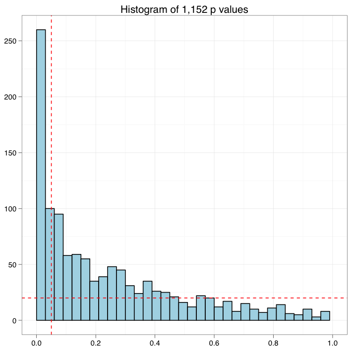

# 多重检验

`Ewan Birney`在他的博客文[Five statistical things I wished I had been taught 20 years ago](http://genomeinformatician.blogspot.hk/2011/06/five-statistical-things-i-wished-i-had.html)中专门提到了多重检验。

>3. The problem of multiple testing, and how to handle it, either with the Expected value, or FDR, and the backstop of many of piece of bioinformatics - large scale permutation. Large scale permutation is sometimes frowned upon by more maths/distribution purists but often is the only way to get a sensible sense of whether something is likely "by chance" (whatever the latter phrase means - it's a very open question) given the complex, hetreogenous data we have. 10 years ago perhaps the lack of large scale compute resources meant this option was less open to people, but these days basically everyone should be working out how to appropriate permute the data to allow a good estimate of "surprisingness" of an observation.

<!--
+ many **thousands of** statistical tests are conducted
+ A substantial number of false positives may accumulate at the **_0.01_** confidence level as **_1%_** of sample differences will be significant even if **no changes in protein expression** exists between the two populations being tested
+ This accumlation of false positives is termed the multiple testing problem and is a general property of a confidence

Karp, N. (2007) Design and Analysis Issues in Quantitative Proteomics Studies, <http://www.mcponline.org/content/6/8/1354>.

---
-->

所有的统计检验都会犯错，实际上无效，结果却是有效，这时候我们犯了I类错误。反之实际上有效，却无法支持，此时犯II类错误。

我们以$\alpha$为阈值，*p*值<$\alpha$，则拒绝零假设，称统计具有显著性。*p*值是个随机数，当零假设为真时，它有$\alpha$的可能性是低于$\alpha$的，也就是以$\alpha$为阈值时，犯I类错误的可能是$\alpha$。

<https://imgs.xkcd.com/comics/significant.png>

如上图所讽刺的，如果我们对20种不同颜色的jelly beans(糖豆)和acne(粉刺)的相关性做检验，以$\alpha = 0.05$为阈值，20次检验随机会有20*0.05 = 1次出现*p*值<$\alpha$的情况，如图中出现的绿色糖豆具有显著性，但我们并不能因此下结论说绿色糖豆与粉刺有关联，因为这实际上是随机出现的结果，这是I类错误。

以$\alpha=0.05$为阈值，我们做一次检验，可信度是0.95, 这里做了20次，那么我们对这20个检验都能够下正确结论的可能性就只有(95%)^20^ = 35.8%。

我们要提高结论的可信度，可以通过降低犯I类错误的概率也是就降低$\alpha$值来实现。比如设$\alpha=0.001$，那么我们下正确结论的可能性就变成(99%)^20^ = 98%。
对所有的检验进行严格控制，Bonferroni方法就是其中最为简单也最为保守的方法。

## The Bonferroni Method

这是最简单、也最保守的方法。给定*p*值P~1~, …, P~m~, 当P~i~ < α/m时才能拒绝零假设H~0i~。

例如我们有10个*p*值来自于10个独立的检验：
	__0.00017, 0.00448__, 0.00671, 0.00907, 0.01220, 
	0.33626, 0.39341, 0.53882, 0.58125, 0.98617 \

以*α = 0.05*为阈值, Bonferroni方法拒绝零假设当*p* < α/10 = 0.005时，上面这10个*p*值，只有前两个是显著的。

Bonferroni方法过于保守，以至于我们都很难去犯I类错误，同时有一些零假设本来应该拒绝的，却没能拒绝（II类错误），而这些可能是我们研究所感兴趣的。特别是在一些探索性的研究中，在保障大部分的显著性是正确的情况下，我们可以允许一些错误，因为在后续的研究中，还会有更进一步的验证研究。而这个需求便产生了假发现率(FDR)的概念，FDR控制真假发现率在一个可接受的范围内。

## Benjamini-Hochberg (BH) 方法

>
> Benjamini and Hochber’s (1995) paper answered the question with what 
> I consider the second most striking theorem of post-war statistics. - 
> Bradley Efron (2010) The Future of Indirect Evidence
>

BH方法定义FDR为假发现在所有显著检验中的比例。

$$FDR \simeq \frac{\#\ of\ false\ positives}{\#\ of\ significant\ tests}$$

假如有*p*值：P~1~ < … < P~m~，定义	I~i~ = i α/C~m~M 以及 R = max{i: P~i~ < I~i~}。

如果*p*值是相互独立的，则C~m~=1。

设T = P~R~, 我们称T为BH拒绝零假设的阈值，拒绝前面i个零假设H~0i~（因为P~i~ < T）。

如果看着定义觉得有点复杂的话，那么我们从数值计算的角度来理解，无非是i的取值从1到m，每次增加1进行迭代，计算I值，检验P~i~ < I~i~是否满足，不满足则跳出循环，找到最大的i，存于R，以R为下标取P~R~为T。所以如下图所示，这是一个切p值香肠的一项运动:)

以同样的一组*p*值为例: **0.00017, 0.00448, 0.00671, 0.00907, 0.01220**, 0.33626, 0.39341, 0.53882, 0.58125, 0.98617

*α = 0.05*的情况下，我们找到最大的i=5满足条件P~i~ < i α/m，于是拒绝前面5个零假设。

## Q value

如果是没有显著变化的实验，那么*p*值的分布会是均匀分布，如左图所示。而一个有显著变化的实验，p值的分布应该更像右图。

Q值是FDR的一种扩展。Q值与p值类似度量显著性。p值度量的是假阳性率，而q值度量的是FDR。

计算q值，首先需要估计p值的背景分布（图中水平线)

继而以每个p值(垂直线）为阈值，估计显著性中的假阳性率。

