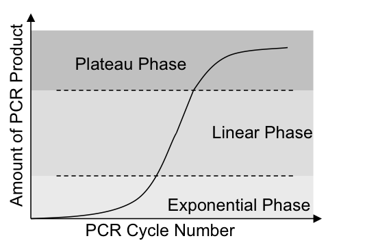

# 生物实验统计分析

## RT-PCR 

RT-PCR相对定量有两个模型，一是$\Delta\Delta{Ct}$ 模型，一个是扩增效率校正模型。这里我们先讨论简单的模型：$\Delta\Delta{Ct}$ 模型，在这一模型中，假定扩增效率为2，即每个PCR cycle，产物倍增，由以下公式给出：

$Ratio = 2^{-\Delta\Delta{Ct}}$

其中$\Delta\Delta{Ct} = \Delta{Ct}_{treated} - \Delta{Ct}_{control}$ , $\Delta{Ct}_{treated}$ 和$\Delta{Ct}_{control}$ 分别是treatment组和control组中目标基因和参照基因的Ct差，即 $\Delta{Ct} = Ct_{target} - Ct_{reference}$ .   

扩增效率肯定是在(1,2)之间，理想状态下才是2，而理想状态通常是不存在的。这个模型的假设点其实是treatment组和control组的扩增效率一样，至于是不是2，比2小多少，并不影响后续的统计分析。

### Data
我们来看以下一份数据，4组重复实验，用RT-PCR测了gene01和gene02的表达量，HK代表house keeping gene，即参照。以下数值为原始的Ct值。

```{r}
ct <- data.frame(
			sample = rep(rep(1:4, each=3), 2),
		treatment = rep(c("Control","Treated"), each=12),
		gene01 = c(23.22,23.34,23.12,24.06,24.15,24.15,23.18,23.13,
					23.10,24.78,24.45,24.67,23.11,22.99,23.10,22.77,
					22.99,23.06,23.73,24.01,23.80,23.73,23.83,23.73),
		gene02 = c(29.08,29.04,29.39,28.23,28.01,28.12,28.79,28.43,
					28.49,31.37,30.74,31.09,27.11,27.24,27.37,25.52,
					25.72,25.52,27.43,26.73,26.65,27.96,27.84,27.98),
		HK = c(19.68,19.69,19.80,19.95,19.93,19.97,19.93,20.02,20.27,
					19.93,19.88,19.90,20.61,19.98,20.57,19.68,19.95,
					19.85,20.27,20.08,20.07,20.10,20.07,20.10)
			)
print(ct)
```

### Data clean
每个sample，测了三次技术重复，我们使用平均值来提高精度。

```{r}
require(plyr)
ct <- ddply(ct, .(sample, treatment), function(x) data.frame(gene01=mean(x$gene01), gene02=mean(x$gene02), HK=mean(x$HK)))
print(ct)
```

### Calculate statistical metric

按照$\Delta\Delta{Ct}$ 模型，我们先计算$\Delta{Ct}$ ，然后计算$\Delta\Delta{Ct}$ ，最终计算出Ratio。

```{r}
delta.ct <- ddply(ct, .(sample, treatment), function(x) data.frame(gene01=x$gene01-x$HK, gene02=x$gene02-x$HK))
print(delta.ct)
## Delta Delta Ct
dd.ct <- subset(delta.ct, treatment=="Treated", select=c(gene01, gene02)) - subset(delta.ct, treatment=="Control", select=c(gene01, gene02))
print(dd.ct)
ratio <- 2^(-1*dd.ct)
print(ratio)
```
这个ratio值计算出，经过扩增后，目的基因在处理组中的产量是对照组的多少倍。

### Statistical Analysis

计算出ratio后，很多人就拿它来做t检验。这种做法是不对的，因为ratio的分布明显是右偏的。从理论上看，PCR的扩增可以分成以下三个阶段，指数扩增、线性扩增、平台期。



当试剂量足够的时候，就处于指数扩增阶段，只有当PCR试剂不足时，才进入线性扩增期，最后当试剂被耗尽时，产物不增长，位于平台期。


在我们的实验中，通常PCR反应是处于指数增长期。我们将其进行对数处理，指数增长就会变成线性增长，这样数据的右偏现象就会有明显减弱，当然我不敢说对数转换后，它就能呈正态分布，但起码对数处理后数据的分布比原始ratio数据更接近正态了。

#### T Test
只有偏态不明显的情况下，才可以用t检验进行分析。

```{r}
## T test for gene01
t.test(log(ratio[,1], base=2), mu = 0)
## T test for gene02
t.test(log(ratio[,2], base=2), mu = 0)
```
##### Use $-\Delta\Delta{Ct}$ directly
如果我们要使用T检验，就得做对数处理，细心的人应该会发现ratio的计算就是指数运算，ratio取对数之后，就是$-\Delta\Delta{Ct}$ ，所以我们可以直接使用它来做检验。
```{r}
## T test for gene02
t.test(-dd.ct[,2])
```

#### ANOVA
另一种方法，使用ANOVA进行统计，这也是参数统计方法，在我们这种小样本的情况下，同样对数据分布有严格的要求，我们不能基于ratio做统计，要基于$\Delta{Ct}$ 值。
```{r}
print(delta.ct)
summary(aov(gene01 ~ treatment, data=delta.ct))
summary(aov(gene02 ~ treatment, data=delta.ct))
```

ANOVA也是比较常用的，而且可以应用于多组实验和多个因素中。但是如果按照上面的代码来做，还不如用T test，因为实验是成对（tretated vs control）进行的，而这个信息在上面的ANOVA分析中，被扔了。

实际上 $-\Delta\Delta{Ct}$ 的单样本T检验，相当于$\Delta{Ct}$ 的双样本T检验。
```{r}
t.test(gene02 ~ treatment, delta.ct, paired=T)
```

而这里用ANOVA，没有用到成对的信息，计算出来的p值和unpaired T test就基本相等。
```{r}
t.test(gene01 ~ treatment, delta.ct, paired=F)
t.test(gene02 ~ treatment, delta.ct, paired=F)
```

做为成对T检验的扩展，使用方差分析进行多组实验的比较，需要用到的是重复测量方差分析（repeated-measures ANOVA）。
```{r}
delta.ct[,1] = factor(delta.ct[,1])
delta.ct[,2] = factor(delta.ct[,2])
summary(aov(gene01 ~ treatment+Error(sample/treatment), data=delta.ct))
summary(aov(gene02 ~ treatment+Error(sample/treatment), data=delta.ct))
```

这样算出来的p值就和成对T检验几乎一样。


#### Wilcoxon Rank Sum Test
我们计算出来的ratio，是经过PCR扩增之后产物的比值，这是经过指数扩增的，而如果我们取对数，相当于消除了指数增长的效果，$-\Delta\Delta{Ct}$ 其实就是原始量的差值。

所以ratio的比较，相当于是扩增后的比较，而$\log_2 {ratio}$ 的比较，则相当于是扩增之前的比较。这两种数据当然都是可以拿来做统计分析的，只不过T test等参数检验方法对数据分布有要求，不适合于ratio值的统计分析而已。如果我们使用非参数检验，则不管是ratio值也好，$\log_2 {ratio}$ 值也好，结果都是一样的。非参数检验并不使用数据的原始值，而是使用其排序值来做检验，我们并不能确定对数处理后的数据就呈正态分布，还有就是通常我们的实验重复次数是非常少的，在这种情况下，使用非参数检验，其实也是一种保守的、不容易犯错的方法。

```{r}
## Wilcoxon Rank Sum test for gene02, original data
wilcox.test( ratio[,2], mu=1)
## Wilcoxon Rank Sum test for gene02, log2 transformed data
wilcox.test( log(ratio[,2], base=2), mu=0)
```
说它不容易犯错，是因为它对数据分布没要求；说它保守，是因为在计算p-value上，灵敏度没有T test这么高，p-value会大一些。

#### Permutation Test

生物学的数据通常比较messy，non-normal，重复次数又少。在我们不能确定数据分布是否正态的情况下，使用参数检验，很可能结果bias太大，使用非参数检验，又觉得power不够大，那么我们可以使用permutation test。这不失为一种好方法，通过随机变换两组数据的标签，观察它们的均值差，我们将得到均值差的分布，将我们实际的测量值对比于随机得到的差值分布，算出随机得到的差值大于实际的测量值的概率。

```{r}
perm.test <- function(d1, d2, nIter=10000) {
	if (length(d2) == 1)
		d2 <- rep(d2, length(d1))
	m <- mean(d2-d1)
 	pooledData <- c(d1, d2)
	n <- length(d1)
	meanDiff <- numeric(nIter)
	for (i in 1:nIter) {
		idx <- sample(1:length(pooledData), n, replace=FALSE)
		d1 <- pooledData[idx]
		d2 <- pooledData[-idx]
		meanDiff[i] <- mean(d2) - mean(d1)
	}
	p <- mean(abs(meanDiff) >= abs(m))
	return(p)
}

perm.test(ratio[,1],1)
perm.test(-dd.ct[,1], 0)
perm.test(ratio[,2],1)
perm.test(-dd.ct[,2], 0)
```
从结果上看，用ratio还是用$-\Delta\Delta{Ct}$ 差不多，这表明原始数据的分布完全不关事。

```

没有吃没有穿
自有那敌人送上前
没有枪没有炮
敌人给我们造

        			----游击队之歌
```

这个方法的奇妙之处，就在于通过bootstrap，产生针对我们统计量的一个背景分布，再由这个背景分布计算出p-value。


### Plot

至于画图，我推荐使用$-\Delta\Delta{Ct}$ 来画，这个CONTROL是0，不用画。如果要用ratio来画，你觉得CONTROL每次都是画一个mean=1，sd=0的柱子，有意义吗？
anyway，我下面的画图代码，同样也适用于拿来画ratio值。

BTW：这里图中标的p值，使用的是T检验算出来的p值。

```{r rt-qpcr.fig1, fig.width=6, fig.height=6}
require(reshape2)
dd.ctm <- melt(-dd.ct)
print(dd.ctm)
dd.cts <- ddply(dd.ctm, .(variable), function(x) data.frame(mean=mean(x$value), sd=sd(x$value)))
print(dd.cts)
require(ggplot2)
p <- ggplot(dd.cts, aes(variable, mean, fill=variable, width=.5))+geom_bar(stat="identity", position=position_dodge(width=.8), colour="black")+geom_errorbar(aes(ymin=mean-sd, ymax=mean+sd), width=.2, position=position_dodge(width=.8))
p <- p+scale_fill_manual(values=c("white", "grey80"))
p <- p+theme_bw()+theme(legend.position="none") + xlab("")+ylab(expression(paste("-", Delta, Delta, "Ct")))
p <- p+theme(axis.text.x=element_text(face="bold", size=14), axis.text.y=element_text(face="bold", size=14), axis.title.y=element_text(size=18, face="bold"))
p <- p+annotate("text", x=2,y=3.5, label="p < 0.005\n**", size=4)
print(p)
```
再来一个箱式图，我其实觉得箱式图比柱状图要好一些，这里我除了用箱式图画数据分布之后，把原始的数据点也给画了。
```{r rt-qpcr.fig2, fig.width=6, fig.height=6}
p2 <- ggplot(dd.ctm, aes(variable, value, fill=variable, colour=variable))
p2 <- p2+geom_boxplot(alpha=.3, width=.5)+geom_dotplot(binaxis='y', stackdir='center', dotsize=.5)
p2 <- p2+theme_bw()+theme(legend.position="none") + xlab("")+ylab(expression(paste("-", Delta, Delta, "Ct")))
p2 <- p2+theme(axis.text.x=element_text(face="bold", size=14), axis.text.y=element_text(face="bold", size=14), axis.title.y=element_text(size=18, face="bold"))
p2 <- p2+annotate("text", x=2,y=3.5, label="p < 0.005\n**", size=4)
print(p2)
```

### Summary

据我的观察，生物坑里大家对T检验特别有爱，我甚至看到用T检验去分析免疫组化数据的，而且还发在Nature子刊上，我都吐槽无力了。如果你喜欢T检验，你要注意数据分布，那么在分析RT-PCR数据上，请用$-\Delta\Delta{Ct}$ 作为统计量，或者将你算完的ratio值取对数也是一样的。用ANOVA时，也必须同样注意。

在这个重复次数少，数据又非常messy的生物世界里，保守点的做法是使用非参数统计，即使你使用ratio这种严重右偏的数据，你的统计分析照样没问题，多学点总是好的，凡事不能太依赖于T检验，因为在很多其它的场景里，正如这里的ratio值，你不能简单套用T检验。

Permutation test其实才是工具箱里不可或缺的一件，应用场景和非参一样广，同时灵敏度又比非参高，你值得拥有。

